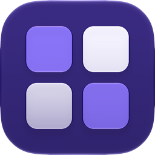
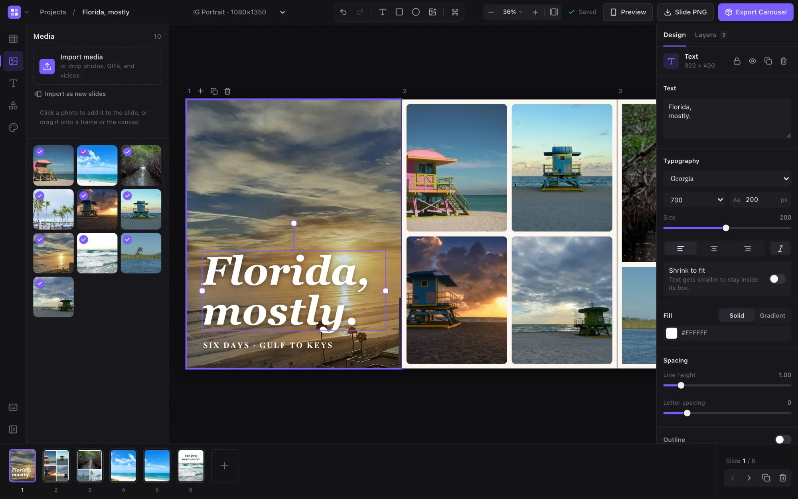
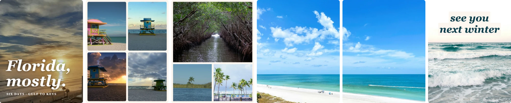
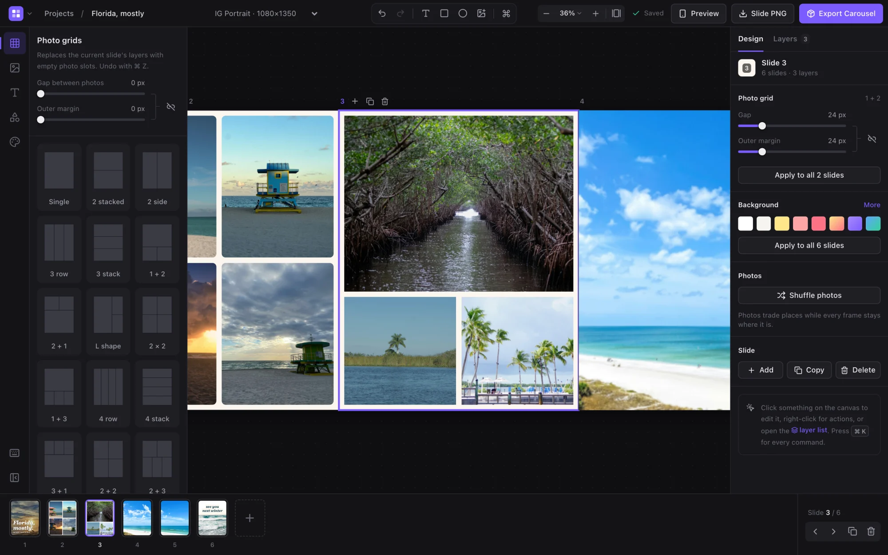
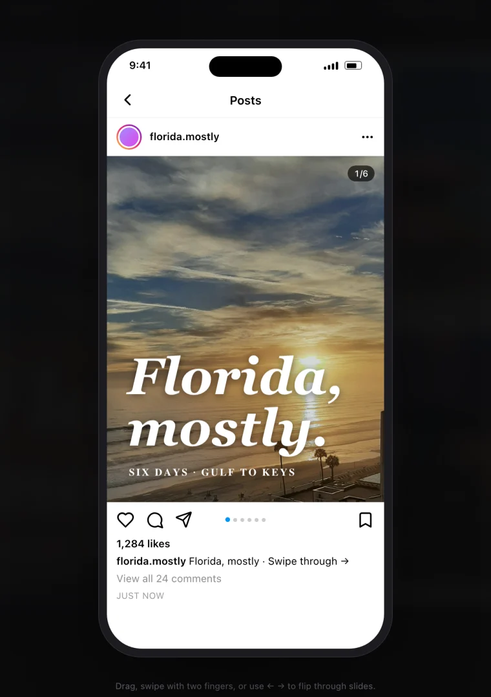
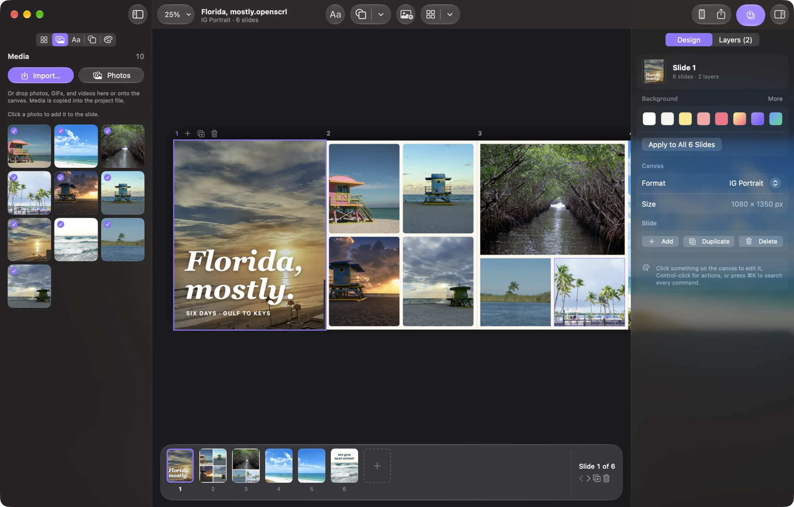

<p align="center">
  
</p>

<h1 align="center">Open-SCRL</h1>

<p align="center">
  Photo carousels and grids for socials, made on your own machine.<br />
  No account, no subscription, nothing uploaded.
</p>

<p align="center">
  <a href="https://github.com/HeyPortal/open-scrl/actions/workflows/ci.yml"></a>
  <a href="https://github.com/HeyPortal/open-scrl/releases"></a>
  <a href="./LICENSE"></a>
</p>



A free, open-source alternative to [SCRL](https://scrl.com), available as a web app and a
native Mac app. Lay your photos out across a row of slides, then export one file per slide
in posting order. It's early, so expect rough edges.



<sub>Slides 4 and 5 are one photo. Wide shots can span slides and line up at the seams.</sub>

- 25 grid layouts, with gap and margin you can change after the photos are in
- Text with outlines, shadows, gradients, and highlight boxes
- Photo masks, borders, and blurred-photo backgrounds
- GIFs and video export as MP4, everything else as PNG, all in one ZIP
- A phone preview of the feed, story, and profile grid crop

<table>
  <tr>
    <td width="62%"></td>
    <td width="38%"></td>
  </tr>
</table>

## Mac app



A separate SwiftUI app in [`macos/`](./macos). Projects are `.openscrl` files, and it adds
Photos import, AirDrop sharing, and Blend Photos for seamless joins between pictures.
[More details](./docs/mac.md).

[Download the latest DMG](https://github.com/HeyPortal/open-scrl/releases/latest) (macOS 27,
Apple silicon). Builds aren't notarized yet, so allow the first launch in
**System Settings ▸ Privacy & Security**.

## Your data

The web app saves everything in your browser. **Clearing the site's data deletes your
projects.** The Mac app saves everything, photos included, in the `.openscrl` file. The
two apps can't open each other's projects yet.

## Development

```bash
npm ci
npm run dev        # http://localhost:5173
npm run verify     # typecheck, lint, tests, build
npm run test:e2e   # Playwright (run `npx playwright install chromium` first)
```

Requires Node 22.12+. For the Mac app, open `macos/OpenSCRL.xcodeproj` in Xcode 27 and run it.

See [web updates and offline tools](docs/web-updates.md) for reload and caching behavior.
[AGENTS.md](./AGENTS.md) has a tour of the code, and the [changelog](./CHANGELOG.md) lists
every release.

## Credits

Screenshot photos are from Unsplash, all taken in Florida, by
[John Maldonado](https://unsplash.com/photos/cATp9I27xsU),
[Jota](https://unsplash.com/photos/q5kqK2HHdfw),
[PhotoHound](https://unsplash.com/photos/zNR0WdLZ6vU),
[eileen byrne](https://unsplash.com/photos/fO6XJydV_tU),
[Edgar Serrano](https://unsplash.com/photos/DOqtBkdGCxg),
[Mark Jacquez](https://unsplash.com/photos/H9Tfe4uNJC8),
[Tom Forrest](https://unsplash.com/photos/cACNO2_m_ao),
[Younho Choo](https://unsplash.com/photos/dd7wQyXMKfo),
[Alexander Raissis](https://unsplash.com/photos/wVc2MReIMoU), and
[London Bridges](https://unsplash.com/photos/u4eO1h-n_TY).

## License

[MIT](./LICENSE). Not affiliated with SCRL or Instagram.
