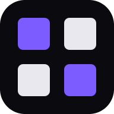

<p align="center">
  
</p>

<h1 align="center">Open-SCRL</h1>

<p align="center">
  A local-first photo grid and social carousel maker.<br />
  Create polished, multi-slide posts in your browser—without accounts, subscriptions, or telemetry.
</p>

<p align="center">
  <a href="https://github.com/HeyPortal/open-scrl/actions/workflows/ci.yml">
    
  </a>
  <a href="./LICENSE">
    
  </a>
  
  
</p>

Open-SCRL is a free, open-source alternative to [SCRL](https://scrl.com). It combines
photo grids, a layer-based editor, and carousel-ready exports in an installable Progressive
Web App. Your projects and original media stay on your device.

> [!NOTE]
> Open-SCRL is in active early development. The Phase 1 editor is functional, but features
> and file formats may continue to evolve.

## Highlights

- **Built for social formats** — start with presets for Instagram, TikTok, and Pinterest,
  then create and reorder multi-slide projects.
- **Flexible canvas tools** — combine images, animated GIFs, videos, text, rectangles, and
  ellipses with crop, zoom, positioning, and stacking controls.
- **Fast photo grids** — choose from layouts such as 1×1, 2×2, 3×3, L-shape, 1+4, and more;
  adjust the gap and auto-fill them with imported photos.
- **Precise editing** — use smart alignment guides, layer locking, visibility controls,
  duplication, renaming, drag-to-reorder, and transactional undo/redo.
- **Local-first persistence** — projects autosave to IndexedDB while original media is kept
  in OPFS. No account or cloud upload is required.
- **Carousel-ready export** — export static slides as lossless PNG and animated slides as
  high-quality H.264 MP4, packaged in posting order.
- **Designed for larger projects** — tiered previews, worker-backed imports and exports,
  bounded image memory, and lightweight navigation frames keep the editor responsive.
- **Installable PWA** — add Open-SCRL to your desktop or home screen for an app-like
  experience.

## Quick start

### Prerequisites

- [Node.js 22+](https://nodejs.org/)
- npm

```bash
git clone https://github.com/HeyPortal/open-scrl.git
cd open-scrl
npm install
npm run dev
```

Open [http://localhost:5173](http://localhost:5173) in your browser.

### Useful commands

| Command | Purpose |
| --- | --- |
| `npm run dev` | Start the local development server |
| `npm run build` | Type-check and create a production build |
| `npm run preview` | Preview the production build locally |
| `npm run verify` | Run type-checking, linting, unit tests, build, and bundle checks |
| `npm run test:e2e` | Run the Playwright end-to-end tests |

## Keyboard shortcuts

| Action | macOS | Windows / Linux |
| --- | --- | --- |
| Undo | `⌘ Z` | `Ctrl Z` |
| Redo | `⌘ ⇧ Z` | `Ctrl Y` |
| Duplicate selected layer | `⌘ D` | `Ctrl D` |
| Delete selected layer | `Delete` / `Backspace` | `Delete` / `Backspace` |
| Pan or zoom the canvas | Scroll / pinch | Scroll / pinch |
| Faster zoom | `⌘` + scroll | `Ctrl` + scroll |
| Edit text in place | Double-click a text layer | Double-click a text layer |

## Under the hood

| Area | Implementation |
| --- | --- |
| App | React 19, TypeScript, Vite, Tailwind CSS |
| Canvas | Konva and `react-konva` |
| State and history | Zustand with Immer patches |
| Local storage | IndexedDB via `idb`, plus OPFS for original media |
| Import and export | Web Workers, Canvas 2D, WebCodecs, MP4 muxing, and Zip.js |
| PWA | `vite-plugin-pwa` with an auto-updating service worker |
| Testing | Vitest and Playwright |

<details>
<summary><strong>Repository layout</strong></summary>

```text
src/
├── app/          Editor shell and lazy boundaries
├── assets/       Media metadata, OPFS/IndexedDB storage, and imports
├── components/   Editor UI, panels, canvas nodes, and filmstrip
├── core/         Framework-independent document and scene model
├── editor/       Session state, history, and persistence
├── export/       Shared Canvas 2D renderer and export worker
├── lib/          Formats, grids, snapping, IDs, and compatibility facades
├── render/       Konva viewport and bounded image resources
├── storage/      Transactional IndexedDB database
└── store/        Compatibility exports and asset UI state
```

</details>

## Roadmap

The Phase 1 MVP is working, with deeper carousel editing, additional creative tools, and
export improvements planned. See [PLAN.md](./PLAN.md) for the full roadmap and architecture
notes.

## License

Open-SCRL is available under the [MIT License](./LICENSE).

Open-SCRL is an independent project and is not affiliated with SCRL or any social platform
mentioned in this README.
