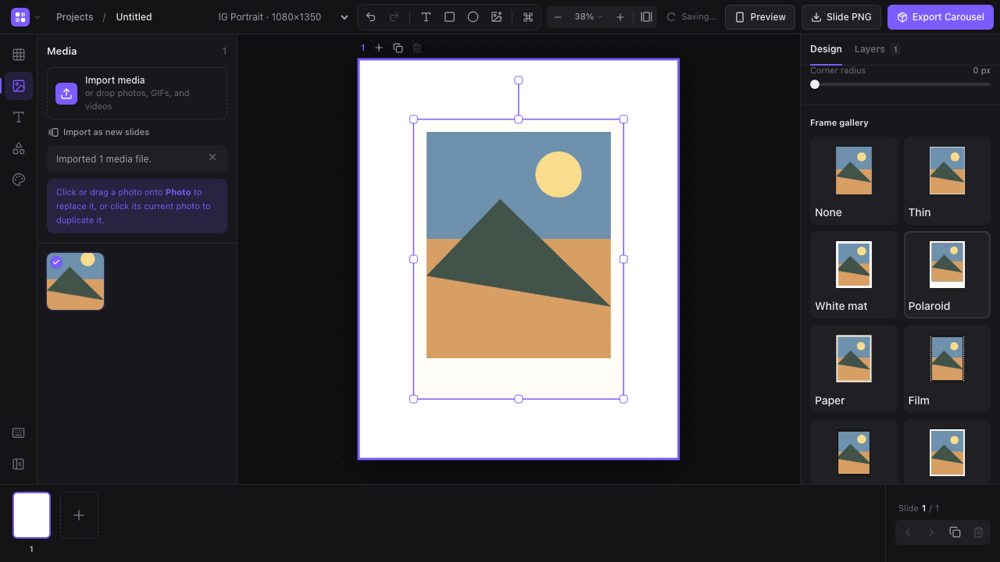

## Photo frame presets (web)

Select a photo and choose None, Thin, White mat, Polaroid, Paper, Film, Black mat, or Postcard in the inspector. Previews use the selected photo, and border width/color remain adjustable. Decorative frames share the canvas and export painter, with crops fitted to their inner openings. Older project borders retain their existing geometry. The optional `frameStyle` schema field is preserved by native Mac project coding; the native app currently uses its existing border rendering.

Decorative frames are an additive schema-v2 field. Project migration preserves missing/known styles and falls back to legacy borders for unsupported styles without modifying the stored input.

