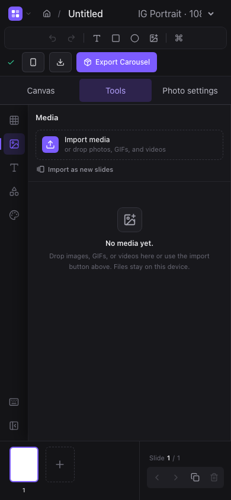

## Narrow-screen editor (web)

Below 768 px, Canvas, Tools, and Photo settings buttons switch between the canvas and overlaid side panels. Import and tool commands open the appropriate panel. The toolbar wraps, inputs and controls have larger touch targets, and the zoom controls hide on small screens. Tablet widths use a wrapped toolbar; desktop panels keep their existing layout.

