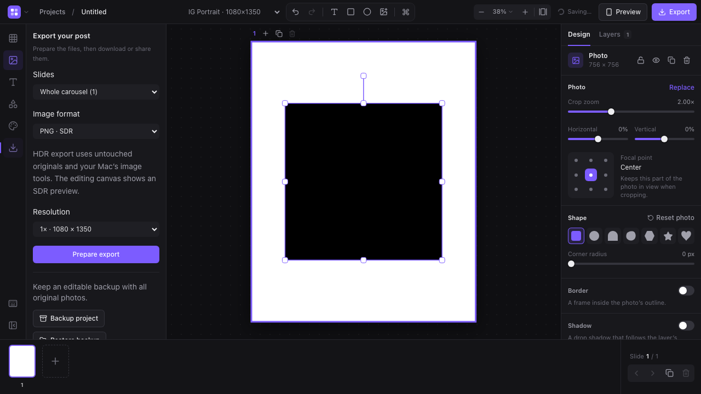

## Portable projects and photo export (web)

The Export panel offers selected/all slides, PNG or JPEG, 1×/2× resolution, ZIP downloads, file sharing where supported, and editable `.openscrl` ZIP backups. Restore creates a new project and validates media before writing it. These web backups are a distinct format from the native Mac app's file-wrapper packages.

Imports retain untouched original bytes alongside converted editing previews. Adaptive HDR JPEG export requires running this web app locally on macOS 15+ with Swift Command Line Tools. Vite provides a same-origin image helper; static hosting continues to support browser SDR export and HEIC conversion fallback. The editor shows SDR previews. Every HDR slide must contain visible HDR highlights; gain-map output is checked, and exports without HDR content fail. Animated media uses the existing PNG/MP4 carousel exporter. Run `npm run test:hdr` on a supported Mac for native codec/composition checks. Physical iPhone/Instagram HDR playback has not been validated.

