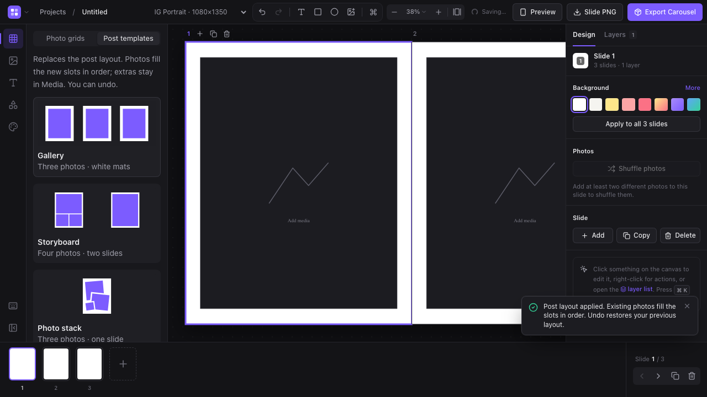

## Post templates (web)

Templates includes the existing Photo grids plus Gallery, Storyboard, and Photo stack post layouts. Apply replaces the post layout in one undoable command and fills slots with existing photos in order; unused media remains available. Save layout stores a reusable template in this browser without photo references or previous crop choices. Saved templates retain their original format and can be removed.

